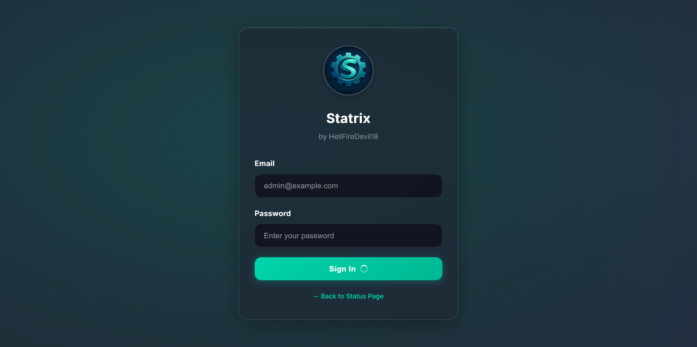
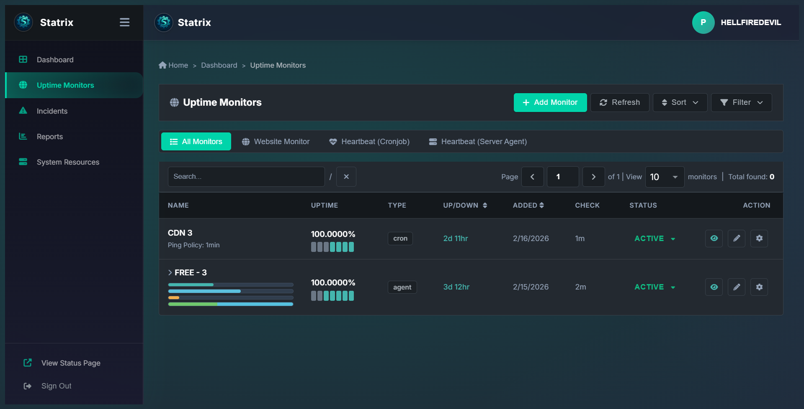
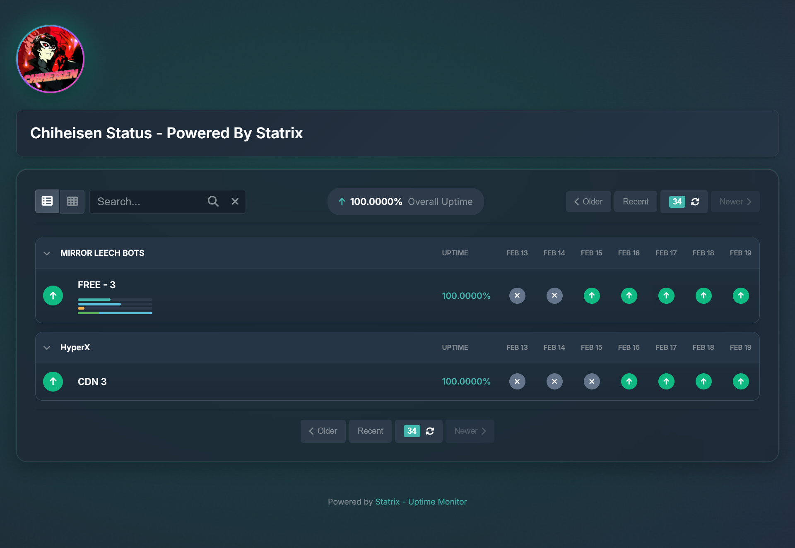
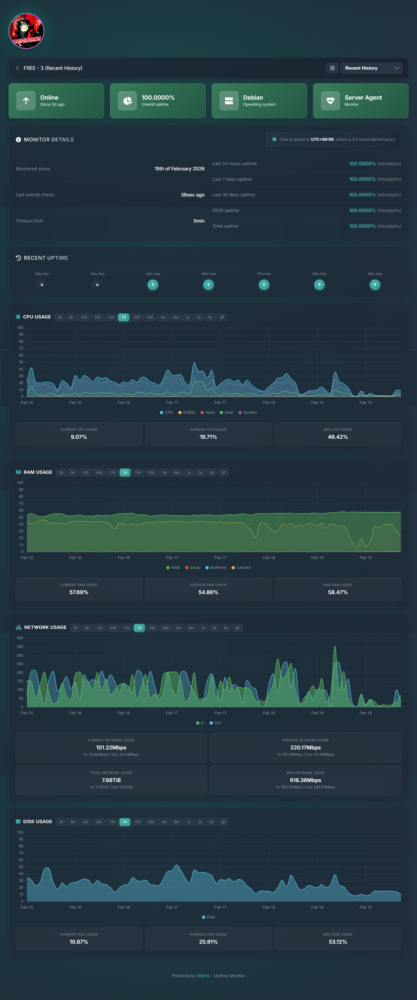
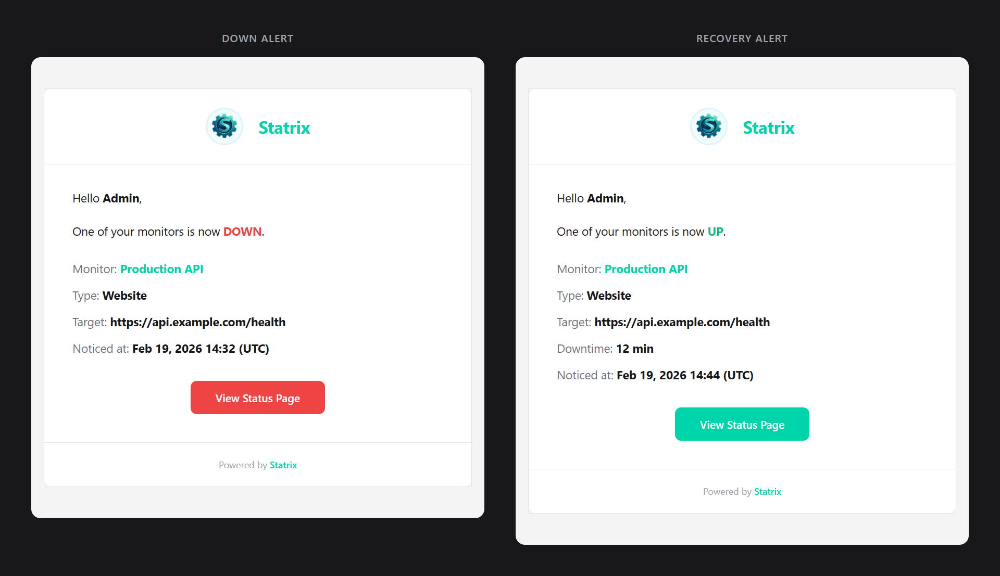

<div align="center">
  

# Statrix

**Self-hosted uptime monitoring, server telemetry & incident management.**

[](https://www.python.org/)
[](https://fastapi.tiangolo.com/)
[](https://www.postgresql.org/)
[](https://redis.io/)
[](LICENSE)

[](https://app.koyeb.com/deploy?name=statrix&type=git&repository=github.com/HellFireDevil18/Statrix&branch=master&builder=dockerfile&dockerfile=Dockerfile&ports=8000:http)

[Live Demo](https://status.chiheisen.de)

</div>

> ⚠️ **Early Stage:** This project is under active development and may contain bugs. If you find any, please [open an issue](https://github.com/HellFireDevil18/Statrix/issues).

---

## 📋 Table of Contents

- [✨ Why Statrix](#-why-statrix)
- [🚀 Features](#-features)
- [📸 Screenshots](#-screenshots)
- [🏗️ Architecture](#️-architecture)
- [📦 Prerequisites](#-prerequisites)
- [⚡ Quick Start (Local)](#-quick-start-local)
- [🐳 Quick Start (Docker)](#-quick-start-docker)
- [☁️ Koyeb Deployment](#️-koyeb-deployment)
- [🔧 Environment Variables](#-environment-variables)
- [📧 Email Alerts (Gmail SMTP)](#-email-alerts-gmail-smtp)
- [🖥️ Server Agent Setup](#️-server-agent-setup)
- [✅ Post-Deployment Checklist](#-post-deployment-checklist)
- [🔍 Troubleshooting](#-troubleshooting)
- [📄 License](#-license)

---

## ✨ Why Statrix

Statrix is built for developers and teams that want **full control** over uptime monitoring — without SaaS lock-in, recurring subscriptions, or third-party data dependencies.

- 🔒 **Own your data** — everything lives in your own PostgreSQL database
- 🌐 **Multi-type monitoring** — websites, cron/heartbeat jobs, and server agents
- 📧 **Email alerts** — downtime and recovery notifications via SMTP
- 📊 **Public status page** — clean, professional, auto-refreshing status page for your users
- 🛡️ **Incident management** — create, track, and resolve incidents with built-in templates
- 🔧 **Maintenance windows** — schedule maintenance to suppress false alerts
- 🏷️ **Monitor categories** — organize monitors into logical groups
- 🔐 **Single admin** — simple, secure JWT-based authentication

---

## 🚀 Features

### 🌐 Monitor Types

| Type | Description | How It Works |
|------|-------------|--------------|
| **Website Monitor** | HTTP/HTTPS health checks | Statrix probes your URL at configurable intervals and records response time, status code, and availability |
| **Heartbeat (Cronjob)** | Ping-based liveness checks | Your app calls a generated Statrix URL on schedule — if the ping stops, Statrix flags it as down |
| **Heartbeat (Server Agent)** | OS-level telemetry | Lightweight agents on Linux, macOS, or Windows report CPU, RAM, disk, and network metrics |

### 📊 Status Page & Incidents

- 🟢 Real-time public status page with overall health indicator
- 📈 30-segment uptime timeline visualization (~3 days per segment)
- 🔔 Active incident banners with full lifecycle tracking (open → resolved)
- 📝 Pre-built incident templates (Major Outage, Partial Outage, Degraded Performance, Scheduled Maintenance, Security Investigation)
- 👁️ Visibility controls — hide resolved incidents from the public page
- 🏷️ Monitor grouping by custom categories

### 📡 Monitoring Capabilities

- ⏱️ Response time tracking and uptime percentage calculation
- ⏸️ Pause/resume individual monitors
- 🔓 Public/private monitor toggles

### 🔔 Notification System

- 📧 SMTP-based downtime and recovery emails
- 🎯 Per-monitor notification toggles

### ⚙️ Operations

- 🧠 Redis cache layer for fast reads with automatic in-memory fallback
- 🔄 Background monitor loops via APScheduler
- 🔐 Leader election lock for safe multi-instance deployments
- 📊 System resource dashboard

---

## 📸 Screenshots

<div align="center">

### 🔐 Login



<br/><br/>

### 📊 Dashboard



<br/><br/>

### 🌐 Public Status Page



<br/><br/>

### 📈 Detailed Monitor Report



<br/><br/>

### 📧 Email Alerts



</div>

---

## 🏗️ Architecture

```
┌─────────────────────────────────────────────────────────┐
│                    Statrix Instance                     │
│                                                         │
│  ┌──────────┐  ┌──────────────┐  ┌───────────────────┐  │
│  │ FastAPI  │  │  Background  │  │   Static Frontend │  │
│  │ REST API │  │  Monitor     │  │   (Vanilla JS)    │  │
│  │          │  │  Loop        │  │                   │  │
│  └─────┬────┘  └───────┬──────┘  └───────────────────┘  │
│        │               │                                │
│  ┌─────▼───────────────▼─────┐                          │
│  │     Redis Cache Layer     │  ◄── Fast reads + state  │
│  │   (in-memory fallback)    │                          │
│  └───────────┬───────────────┘                          │
│              │                                          │
│  ┌───────────▼───────────────┐                          │
│  │     PostgreSQL (asyncpg)  │  ◄── Source of truth     │
│  └───────────────────────────┘                          │
└─────────────────────────────────────────────────────────┘
         ▲                    ▲
         │                    │
    Server Agents        Heartbeat Pings
  (Linux/macOS/Win)      (Cronjob URLs)
```

**Key components:**

- **`backend/`** — FastAPI application serving REST APIs and static frontend
- **PostgreSQL** — persistent storage and source of truth
- **Redis** — cache layer for fast reads, shared state, and leader election
- **APScheduler** — background loops for monitor checks and notifications
- **Server agents** — OS-level scripts posting telemetry to `/v2/` (Linux/macOS) or `/win/` (Windows)

---

## 📦 Prerequisites

| Requirement | Details |
|-------------|---------|
| 🐍 **Python** | `3.13+` (for local development) |
| 🐘 **PostgreSQL** | Supabase, Neon, or self-hosted |
| 🔴 **Redis** | Recommended for production (Aiven Valkey, Upstash, or self-hosted) |
| 📧 **SMTP Account** | Optional but recommended for alerts |

---

## ⚡ Quick Start (Local)

```bash
# 1. Clone the repository
git clone https://github.com/HellFireDevil18/Statrix.git
cd Statrix

# 2. Create your environment file
cp .env.example .env
# Edit .env with your real values (see Environment Variables below)

# 3. Install dependencies
pip install -r requirements.txt

# 4. Start the application
uvicorn backend.main:app --host 0.0.0.0 --port 8000
```

Once running, open:

| Page | URL |
|------|-----|
| 📊 Public status page | `http://localhost:8000/` |
| 🔐 Admin dashboard | `http://localhost:8000/edit` |
| 💚 Health check | `http://localhost:8000/health` |

---

## 🐳 Quick Start (Docker)

```bash
# Build the image
docker build -t statrix .

# Run with your environment file
docker run --name statrix -p 8000:8000 --env-file .env statrix
```

---

## ☁️ Koyeb Deployment

### Option A: One-Click Deploy ⚡

Click the **Deploy to Koyeb** button at the top of this README.

### Option B: Manual Setup

1. Create a new Koyeb App and link your Statrix repository.
2. Select branch `master`.
3. Build method: **Dockerfile**.
4. Port: **8000** (HTTP).
5. Health check path: `/health`.
6. Scaling: start with `min=1`, `max=1` and `WEB_CONCURRENCY=1`.
7. Add environment variables from the tables below.
8. Deploy and verify `/health` returns healthy.

> 💡 **Tips:**
> - `koyeb.yaml` is included and pre-maps required environment variables.
> - If using Upstash Redis, provide a TLS URL (`rediss://...`).
> - When `CACHE_FAIL_FAST=true`, API endpoints return `503` if cache is unhealthy — this is by design.

---

## 🔧 Environment Variables

Use [`.env.example`](.env.example) as your baseline. All variables are aligned with [`backend/config.py`](backend/config.py) and [`koyeb.yaml`](koyeb.yaml).

### 🔑 Required Core

| Variable | Required | Default | Description |
|----------|:--------:|---------|-------------|
| `DATABASE_URL` | ✅ | — | PostgreSQL connection string (`postgresql://...`) |
| `ENCRYPTION_KEY` | ✅ | — | Encryption key for sensitive data at rest |
| `JWT_SECRET_KEY` | ✅ | — | Secret key for JWT token signing |
| `OWNER_EMAIL` | ✅ | — | Admin account email (created on first startup) |
| `OWNER_PASSWORD` | ✅ | — | Admin account password (created on first startup) |
| `APP_URL` | ✅ (prod) | `http://localhost:8000` | Public base URL for generated links and notifications and receiving information from heartbeat monitors |

<details>
<summary>🔑 <b>Generate secrets from the command line</b></summary>

```bash
# Generate Fernet encryption key
python -c "from cryptography.fernet import Fernet; print(Fernet.generate_key().decode())"

# Generate JWT secret key
python -c "import secrets; print(secrets.token_urlsafe(32))"
```

</details>

### 🏷️ Application & Auth

| Variable | Required | Default | Description |
|----------|:--------:|---------|-------------|
| `OWNER_NAME` | ❌ | *(empty)* | Display name for admin user |
| `APP_NAME` | ❌ | `Statrix` | Application name shown in UI |
| `COMPANY_NAME` | ❌ | `Statrix` | Company name for branding |
| `JWT_ALGORITHM` | ❌ | `HS256` | JWT signing algorithm |
| `JWT_EXPIRE_HOURS` | ❌ | `168` | Token expiration (7 days) |
| `CORS_ORIGINS` | ❌ | `["http://localhost:8000","http://127.0.0.1:8000"]` | Allowed CORS origins (JSON array) |
| `STATUS_PAGE_TITLE` | ❌ | `Statrix Status` | Public status page title (browser tab & heading) |
| `STATUS_LOGO` | ❌ | *(empty)* | Custom HTTPS logo URL for status page |

### 📧 Notifications (SMTP)

| Variable | Required | Default | Description |
|----------|:--------:|---------|-------------|
| `SMTP_SERVER` | ❌ | `smtp.gmail.com` | SMTP host |
| `SMTP_PORT` | ❌ | `587` | SMTP TLS port |
| `SMTP_USER` | ⚠️ | *(empty)* | SMTP login username (required for alerts) |
| `SMTP_PASS` | ⚠️ | *(empty)* | SMTP password or App Password (required for alerts) |
| `SMTP_FROM` | ❌ | *(empty)* | Sender address (falls back to `SMTP_USER`) |
| `NOTIFICATION_EMAIL` | ⚠️ | *(empty)* | Target email for alerts (required for alerts) |

### 🧠 Cache & Runtime

| Variable | Required | Default | Description |
|----------|:--------:|---------|-------------|
| `CACHE_BACKEND` | ❌ | `redis` | Cache backend (`redis` or `inmemory`) |
| `REDIS_URL` | ⚠️ | *(empty)* | Redis connection string (required when `CACHE_BACKEND=redis`) |
| `CACHE_FAIL_FAST` | ❌ | `true` | Return 503 when cache is unhealthy |
| `CACHE_WARMUP_FULL` | ❌ | `true` | Preload cache from DB at startup |
| `CACHE_KEY_PREFIX` | ❌ | `statrix:v1` | Redis key namespace |
| `CACHE_WARMUP_BATCH_SIZE` | ❌ | `500` | Warmup pipeline batch size |
| `CACHE_REBUILD_INTERVAL_SECONDS` | ❌ | `30` | Auto-resync interval on cache failure |
| `MONITOR_LEADER_LOCK_ENABLED` | ❌ | `true` | Prevent duplicate sweeps in multi-worker setups |
| `MONITOR_LEADER_LOCK_TTL_SECONDS` | ❌ | `90` | Redis leader lock TTL |
| `CHECK_INTERVAL_SECONDS` | ❌ | `60` | Monitor check loop interval |
| `NOTIFICATION_CHECK_INTERVAL_SECONDS` | ❌ | `30` | Notification check loop interval |
| `WEB_CONCURRENCY` | ❌ | `1` | Keep at `1` until leader-lock is validated |


---

## 📧 Email Alerts (Gmail SMTP)

Statrix supports email notifications for downtime and recovery using **Gmail SMTP** — no paid email APIs required.

| | |
|---|---|
| ✅ Free | ✅ Reliable for monitoring alerts |
| ✅ Easy to migrate later | ❌ Not suitable for bulk/marketing email |

> ⚠️ Gmail may show `via gmail.com` in some clients. This is expected for Gmail SMTP.

### 📋 Overview

| Setting | Value |
|---------|-------|
| **From address** | `alerts@your-domain.tld` |
| **SMTP provider** | Gmail (`smtp.gmail.com`) |
| **Authentication** | App Password (requires 2-Step Verification) |

### 1️⃣ Prerequisites

- A dedicated Gmail account (e.g. `statrix.alerts@gmail.com`)
- 2-Step Verification enabled on that Google account
- Access to your DNS provider (Cloudflare, Namecheap, etc.)

### 2️⃣ Configure "Send Mail As" in Gmail

1. Sign in to the Gmail account.
2. Go to **Settings → See all settings → Accounts and Import**.
3. Under **Send mail as**, select **Add another email address**.
4. Configure:
   - **Name:** `Statrix Alerts`
   - **Email:** `alerts@your-domain.tld`
   - **Treat as alias:** unchecked

### 3️⃣ SMTP Configuration

| Setting | Value |
|---------|-------|
| **SMTP Server** | `smtp.gmail.com` |
| **Port** | `587` |
| **Username** | `statrix.alerts@gmail.com` |
| **Password** | *Your App Password* |
| **Security** | TLS |

> 🔒 **Important:** Do not use your Gmail account password. Use an [App Password](https://support.google.com/accounts/answer/185833) only.

### 4️⃣ Verify Sending Address Ownership

If `alerts@your-domain.tld` has no mailbox, use temporary forwarding for one-time verification:

1. Enable email routing at your DNS provider.
2. Create route: `alerts@your-domain.tld` → `your-personal@gmail.com`.
3. Add required MX records.
4. In Gmail, click **Verify**.
5. Open forwarded verification email and confirm.

After verification, you can safely remove the temporary forwarding rule and MX records. Gmail keeps the sender verified.

### 5️⃣ DNS Deliverability Records

**SPF** (required):

```
your-domain.tld  TXT  "v=spf1 include:_spf.google.com ~all"
```

**DMARC** (recommended):

```
_dmarc.your-domain.tld  TXT  "v=DMARC1; p=none"
```

### 6️⃣ Test Your SMTP Setup

```python
import smtplib
from email.message import EmailMessage
from datetime import datetime, timezone

SMTP_SERVER = "smtp.gmail.com"
SMTP_PORT = 587
SMTP_USER = "statrix.alerts@gmail.com"
SMTP_PASS = "APP_PASSWORD"

FROM_EMAIL = "Statrix Alerts <alerts@your-domain.tld>"
TO_EMAIL = "your-personal@gmail.com"

msg = EmailMessage()
msg["From"] = FROM_EMAIL
msg["To"] = TO_EMAIL
msg["Subject"] = "Statrix SMTP Test Successful"
msg.set_content(f"""
This is a test email from Statrix.

Time: {datetime.now(timezone.utc).isoformat()} UTC
Status: SMTP delivery OK
""")

with smtplib.SMTP(SMTP_SERVER, SMTP_PORT) as server:
    server.starttls()
    server.login(SMTP_USER, SMTP_PASS)
    server.send_message(msg)

print("✅ Email sent successfully")
```

```bash
python smtp_test.py
```

### 7️⃣ Statrix SMTP Environment Example

```env
SMTP_SERVER=smtp.gmail.com
SMTP_PORT=587
SMTP_USER=statrix.alerts@gmail.com
SMTP_PASS=APP_PASSWORD
SMTP_FROM=Statrix Alerts <alerts@your-domain.tld>
NOTIFICATION_EMAIL=your-personal@gmail.com
```

### 📊 Gmail SMTP Limits

- ~100 emails/day on most personal accounts
- Best suited for uptime and transactional alerts
- Not recommended for bulk sending

---

## 🖥️ Server Agent Setup

For full cross-platform agent documentation, see [`shell/README.md`](shell/README.md).

### Quick Flow

1. 🖥️ Create a **Server Agent** monitor in the dashboard.
2. 📋 Copy the generated install command.
3. ▶️ Run it on the target host (Linux / macOS / Windows).

The dashboard command includes your exact `SID`, endpoint URL, and selected monitoring options — no manual configuration needed.

---

## ✅ Post-Deployment Checklist

- [ ] `GET /health` returns `healthy`
- [ ] Admin login works at `/edit`
- [ ] Create a test website monitor and force a failure
- [ ] Confirm downtime email arrives after `OFFLINE_NOTIFICATION_MINUTES`
- [ ] Recover the target and verify recovery email
- [ ] Confirm status page reflects state changes at `/`

---

## 🔍 Troubleshooting

<details>
<summary>💥 <b>App fails at startup</b></summary>

- Verify `DATABASE_URL`, `ENCRYPTION_KEY`, and `JWT_SECRET_KEY` are set correctly.
- Confirm the database is reachable from the runtime environment.
- Check logs for connection errors.

</details>

<details>
<summary>🔴 <b>Redis / cache errors</b></summary>

- Verify `REDIS_URL` uses `redis://` (plain) or `rediss://` (TLS).
- When `CACHE_FAIL_FAST=true`, APIs intentionally return `503` if cache is unhealthy.
- For first deployment, keep `WEB_CONCURRENCY=1`.
- Statrix falls back to in-memory cache if Redis is unavailable.

</details>

<details>
<summary>📧 <b>No email alerts</b></summary>

- Confirm `SMTP_USER`, `SMTP_PASS`, and `NOTIFICATION_EMAIL` are set.
- Verify you're using a Gmail App Password (not your account password).
- Validate sender verification when using a custom from-address.
- Check spam/junk folders.

</details>

<details>
<summary>🖥️ <b>Agent not reporting</b></summary>

- Verify `APP_URL` is correct and reachable from the agent host.
- Reinstall the agent using the dashboard-generated command.
- Review [`shell/README.md`](shell/README.md) for agent documentation.

</details>


---

## 💰 Sponsors and Donations

Open-source is hard! If you enjoy this project and want to support its development, please consider sponsoring or donating!

[🧸 Support the Project - 地獄の火の悪魔](https://telegram.me/hellfiredevil)

---

## 📄 License

[MIT](LICENSE)

---

<div align="center">
  
  <p>
    <em>Made with ❤️ by <a href="https://telegram.me/HellFireDevil">HellFireDevil18</a></em><br/>
    <em>Inspired by <a href="https://hetrixtools.com">HetrixTools</a></em>
  </p>
</div>

## 🙏 Credits

- [HellFireDevil](https://telegram.me/HellFireDevil) for creating it from scratch
- Some AI Tools have been used to create certain portions of this repository.
